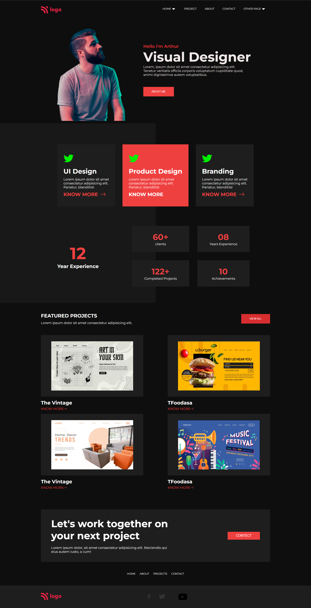

# Hey Welcome

Hi, My name is Uvesh Khatri and I have completed the 15th Project of the iNeuron Full Stack Course.

# Project 15

In this project i have created a Product Design Landing Page from Scratch. And i have learnt a lot of things like Position, flexbox.

It took me 6 Hours to complete this project
## Tech Stack Used 
- HTML5

- CSS

## My Project is looking like :

[Live Link](https://uveshkhatri-product-design-landing-p.netlify.app/)